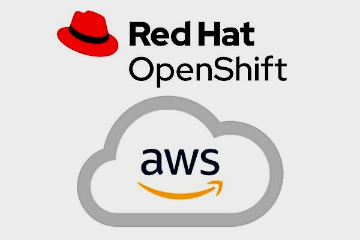

# OpenShift 4 IPI AWS

Repository for Automate OpenShift 4 IPI Deployments in Connected, Disconnected and Restricted Scenarios using AWS

There are different approaches for each mode, but always an IPI installation is used.

## 1. Prerequisites

* [Prerequisites for Private / Disconnected Installation](/docs/prereqs.md)

## 2. Installation Modes

* [Connected Installation](/docs/mode-connected.md)
* [Private/Restricted Installation](/docs/mode-private.md)
* [Disconnected/AirGapped Installation](/docs/mode-disconnected.md)

## 3. Platforms Tested

* Tested from Fedora34 with Ansible 2.9.18 and python 3.6
* OpenShift 4.6.x and OpenShift 4.9.x
* Latest Test - 4.9.11
