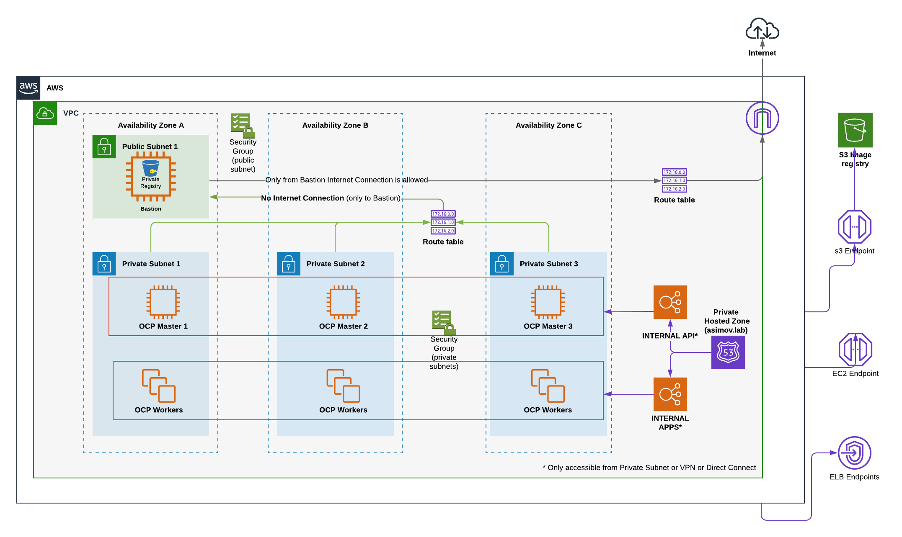

# IPI Installation - Mode Disconnected

## Diagram Private Installation

The following items are not required or created when you install a disconnected cluster:

* A BaseDomainResourceGroup, since the cluster does not create public records
* Public IP addresses
* Public DNS records
* Public endpoints
* External LoadBalancers 

## Automation for deploy the Disconnected OpenShift cluster

### With AWS-CLI

* [6. Configure Bastion](../aws-cli/disconnected/6-configure-bastion.md)
* [7. Install OCP4 Disconnected](../aws-cli/disconnected/7-installocp4disconnected.md)
* [8. Post Install OCP4](../aws-cli/disconnected/8-post-install.md)
* [9. Optional](../aws-cli/disconnected/9-optional.md)
