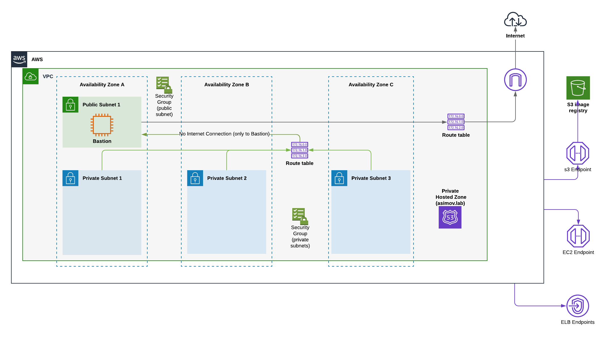

# Prerequisites for Restricted (Privated / Disconnected) Installation in AWS

In an installation of a Openshift4 in a Preexistent VPCs and with Restricted Environment (Private
or Disconnected) some prerequisites needs to be present.

To create a private cluster on AWS, you must provide an existing private VPCs and subnets to host the cluster.

The installation program must also be able to resolve the DNS records that the cluster requires. The installation program configures the Ingress Operator and API server for only internal traffic.

## Required AWS Roles

When you attach the AdministratorAccess policy to the IAM user that you create in Amazon Web Services (AWS), you grant that user all of the required permissions.

To deploy all components of an OpenShift Container Platform cluster, the IAM user requires the [following permissions](https://docs.openshift.com/container-platform/4.7/installing/installing_aws/installing-aws-account.html#installation-aws-permissions_installing-aws-account)

## [Requirements for using your VPCs](https://docs.openshift.com/container-platform/4.5/installing/installing_aws/installing-aws-private.html#installation-custom-aws-vpc-requirements_installing-aws-private)

The installation program no longer creates the following components:

* Internet gateways
* NAT gateways
* Subnets
* Route tables
* VPCs
* VPC DHCP options
* VPC endpoints

If you use a custom VPC, you must correctly configure it and its subnets for the installation program and the cluster to use. The installation program cannot subdivide network ranges for the cluster to use, set route tables for the subnets, or set VPC options like DHCP, so you must do so before you install the cluster.

Your VPC must meet the following characteristics:

* The VPC’s CIDR block must contain the Networking.MachineCIDR range, which is the IP address pool for cluster machines.
* The VPC must not use the kubernetes.io/cluster/.*: owned tag.
* You must enable the enableDnsSupport and enableDnsHostnames attributes in your VPC so that the cluster can use the Route 53 zones that are attached to the VPC to resolve cluster’s internal DNS records. See DNS Support in Your VPC in the AWS documentation.

If you use a cluster with public access, you must create a public and a private subnet for each availability zone that your cluster uses. The installation program modifies your subnets to add the kubernetes.io/cluster/.*: shared tag, so your subnets must have at least one free tag slot available for it. Review the current Tag Restrictions in the AWS documentation to ensure that the installation program can add a tag to each subnet that you specify.

If you are working in a disconnected environment, you are unable to reach the public IP addresses for EC2 and ELB endpoints. To resolve this, you must create a VPC endpoint and attach it to the subnet that the clusters are using. The endpoints should be named as follows:

* ec2.<region>.amazonaws.com
* elasticloadbalancing.<region>.amazonaws.com
* s3.<region>.amazonaws.com

## Diagram for Prerequites in AWS

Before launch the installation, need to be created these prerequisites:

* 1 x VPC 
* 1 x Public Subnet (Only for bastion)
* 1 x Internet Gateway (Only for bastion to reach internet)
* 1 x Route Table (attach to Public Subnet with routing to IGW)
* 1 x EIP (only for Bastion Host)
* 1 Security Group (Allowing the Outbound to 0.0.0.0 and 
* 1 x Security Group (for public Subnet allow ingress 22, and all Private Subnets, Outgoing all)
* 3 x Private Subnet (1 x AZ)
* 1 x Private Hosted Zone (A entry of Bastion Host acting as Mirror Registry)
* 1 x Security Group (private Subnets, deny egress to Internet, allow egress / ingress all VPC)
* 1 x Route Table (attach to Private Subnets, only routing to VPC, NO to IGW, no NAT Gw)
* 1 x VPC Endpoint to s3
* 1 x VPC Endpoint to ELB
* 1 x VPC Endpoint to EC2

## Automation for deploy this prereqs

### With AWS-CLI 

If you want to install only the prerequisites listed in this doc, please review the following links:

* [1. Prerequisites](../aws-cli/common/1-prereqs.md)
* [2. VPCs](../aws-cli/common/2-vpcs.md)
* [3. Bastion](../aws-cli/common/4-install-bastion.md)
* [4. Route53](../aws-cli/common/5-route53.md)

### With Terraform 

* [1. Terraform](../tf/README.md)
